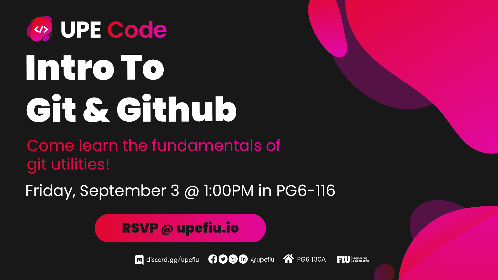

# Overview
This repository is an interactive activity for those who attend UPE Code's Git and GitHub workshop.  
Below is a list of people that made pull requests to the repository to add their name, ingraining it permenantly in this repository!

# Developers:
Zackary Santana  
Karanveer Sandhu  
Daniel Ortiz  
Vanessa Chu  
Carlos Chavez  
Eddie Briscoe  
Steven Fernandez v2 
Rebeca Martin  
David Barcenas  
Daniel Carlson  
Katia Mahoudeau  
Christopher Rodriguez  
Alexis Diaz  
Jorge Leon  
Angela Cruz  
Musa Jean  
Aiden Shi  
Alejandro Vecchio  
Naomi Lima  
Daniel Gonzalez
Noah Pineiro  
Jesus Fernandez  
Stella Murcia  
Julian Lopez  
Ricardo Colom  
Samuel Pellot  
Dariel Brito  
Steven Montecinos  
Natalie Almonte  
Javier Lemus  
Miguel Jacome  
Carlos Fiallo Reyes  
Eva Sennrich  
Stephanie Montecinos  

 

### Additional Notes
The workshop was on 9/1/2021 and was an interactive way to practice markdown files while contributing to a practice open-source project.

